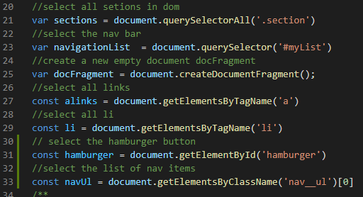
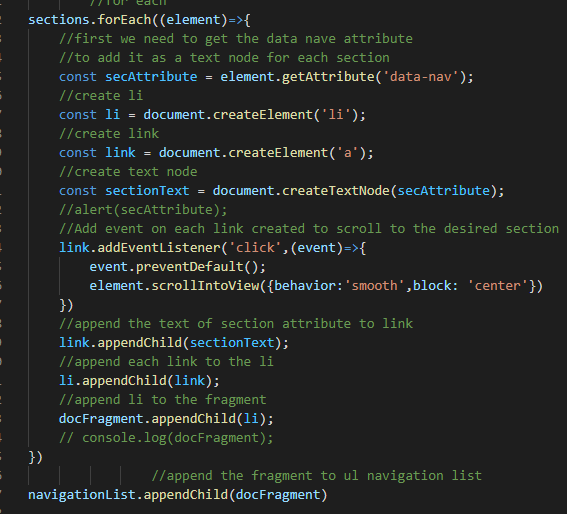
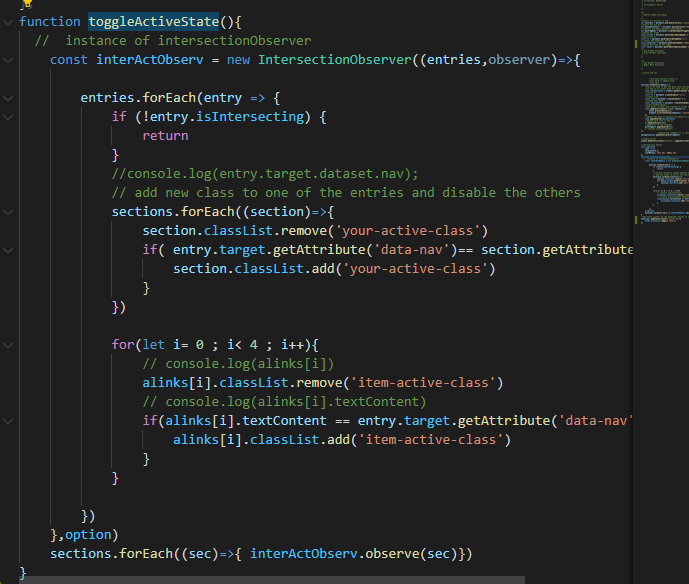
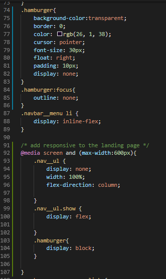

# Landing Page Project

## Table of Contents

* [Instructions](#instructions)

## Instructions
1. select all global variables
2. create new elements and append it the fragment variable
3. create function called toggleActiveState that control evety thing
4. add responsive css page

### 1. select all global variables

### 2. create new elements

### 3. create function called toggleActiveState

### 4. add responsie nav par 
